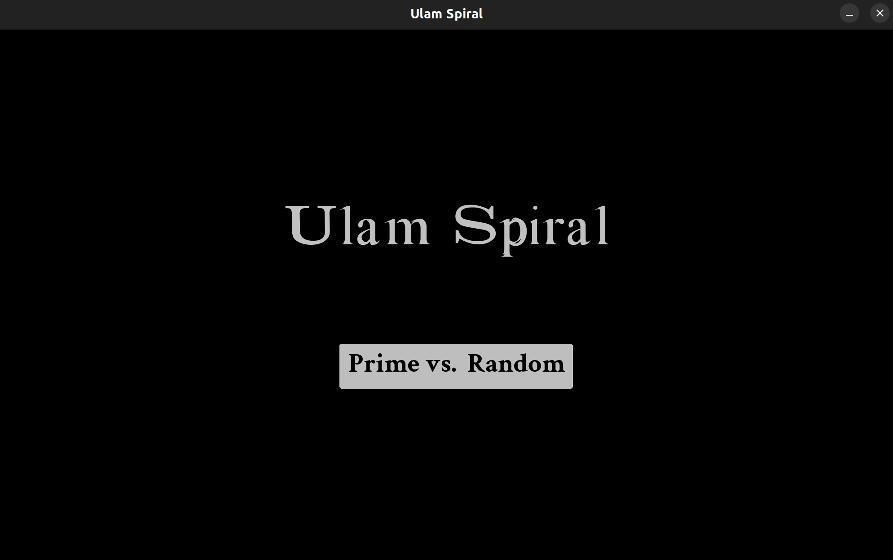
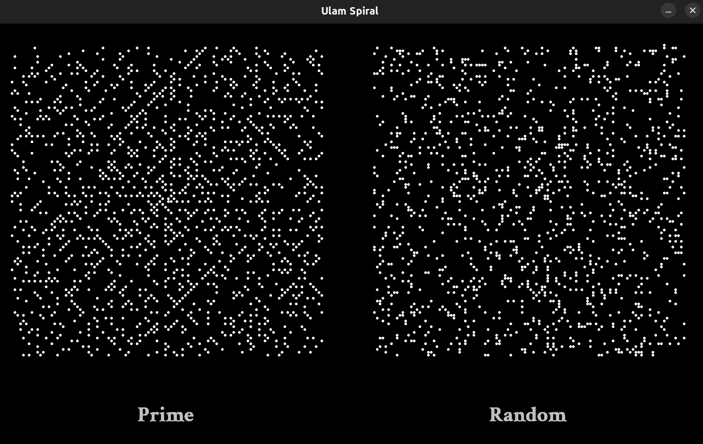

# Ulam Spiral (Prime Spiral)

A visualizer that compares prime spirals with randomized spirals side by side to show others the wonder that is prime numbers!

## Screenshots




## Installation 


Check that you have Python installed using the following command

```bash
python3 --version
```
If you don't have Python installed then 
### Linux (Ubuntu)
```bash
sudo apt update
sudo apt install python3
```
### Windows 
use the [Official Python Website](https://www.python.org/downloads/windows/) 

### Then install Pygame

### Linux
```bash
python3 -m pip install -U pygame --user
```
### Windows
```bash
pip install pygame
```

## Usage
Clone the repo then run spiral.py

